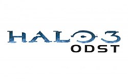

# 🟢 Saga HALO — Une Série de Jeu Débuté en 2001
_logo.svg.png)

Un résumé clair et complet de **tous les jeux [Halo](https://fr.wikipedia.org/wiki/Halo_(série_de_jeux_vidéo))**, présentés **un par un**, dans l’ordre de sortie.

---

## 1️⃣ Halo: Combat Evolved (2001)

Le joueur incarne **Master Chief**, un super-soldat Spartan-II, accompagné de l’IA **Cortana**.  
Après la destruction du vaisseau humain *Pillar of Autumn*, ils découvrent **Halo**, un anneau-monde mystérieux.

On apprend que Halo n’est pas une arme contre le Covenant, mais contre une menace bien plus grave :  
**le Flood**, un parasite capable d’exterminer toute vie intelligente.

> Pose les bases de tout l’univers Halo.

---

## 2️⃣ Halo 2 (2004)

L’histoire alterne entre **Master Chief** et **l’Arbiter**, un Élite du Covenant.  
Le jeu explore la politique interne du Covenant et révèle que leur religion repose sur un mensonge.

La guerre s’intensifie et les alliances commencent à se briser.

> Plus mature, plus politique et plus sombre.

---

## 3️⃣ Halo 3 (2007)

Conclusion de la trilogie originale.  
Humains, Élites et l’Arbiter s’allient pour stopper le Covenant et éradiquer définitivement le Flood.

Master Chief accomplit sa mission ultime… puis disparaît.

> Épique, héroïque et émotionnel.

---

## 4️⃣ Halo 3: ODST (2009) *(Spin-off narratif)*

Le joueur incarne un soldat **ODST**, sans armure Spartan.  
L’action se déroule dans une ville détruite, de nuit, après une invasion du Covenant.

Le jeu met l’accent sur l’atmosphère, la solitude et l’enquête.

> Une vision plus humaine de la guerre.

---

## 5️⃣ Halo: Reach (2010)

Préquel de la saga.  
On incarne **Noble Six**, membre de la Noble Team, chargée de défendre la planète **Reach**.

La mission est perdue d’avance : Reach tombera.

> Une tragédie militaire marquée par le sacrifice.

---

## 6️⃣ Halo 4 (2012)

Début de la nouvelle saga développée par **343 Industries**.  
Master Chief se réveille après des années de dérive spatiale.

Cortana commence à souffrir de **rampance**, tandis qu’un ancien ennemi Forerunner, **le Didacte**, apparaît.

> Un épisode plus émotionnel et introspectif.

---

## 7️⃣ Halo 5: Guardians (2015)

L’histoire est partagée entre **Master Chief** et le Spartan **Locke**.  
Cortana revient, mais elle a changé : elle veut imposer la paix par la force grâce aux **Gardiens Forerunners**.

Master Chief devient un fugitif.

> Ambitieux mais controversé.

---

## 8️⃣ Halo Infinite (2021)

Retour aux sources.  
Master Chief est isolé sur un anneau Halo endommagé, affrontant une nouvelle faction : **les Bannis**.

Cortana est absente, remplacée par une nouvelle IA appelée **The Weapon**.

> Un hommage moderne à Halo: Combat Evolved.

---

# ⚔️ Spin-offs Stratégie

## 9️⃣ Halo Wars (2009)

Jeu de stratégie en temps réel.  
Se déroule avant Halo CE et suit l’équipage du vaisseau **Spirit of Fire** face au Covenant.

---

## 🔟 Halo Wars 2 (2017)

Suite directe de Halo Wars.  
Introduction des **Bannis**, futurs antagonistes principaux de Halo Infinite.

Le *Spirit of Fire* revient après 28 ans de dérive spatiale.

---

# 📱 Autres jeux Halo

- **Halo: Spartan Assault**
- **Halo: Spartan Strike**
- **Halo: Fireteam Raven**
- **Halo: The Master Chief Collection** (compilation remasterisée)

---

# 🟩 En résumé

Halo, c’est :
- 🧑‍🚀 Un héros mythique : **Master Chief**
- 🤖 Une IA iconique : **Cortana**
- 🌌 Une guerre galactique épique
- 🎭 Des thèmes forts : sacrifice, devoir, humanité

---

> *"I need a weapon."* — Master Chief
